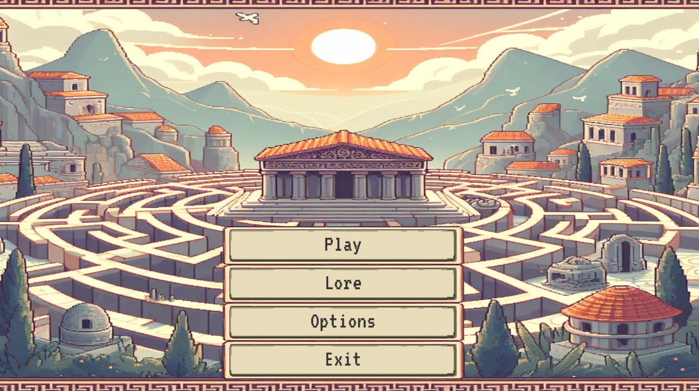
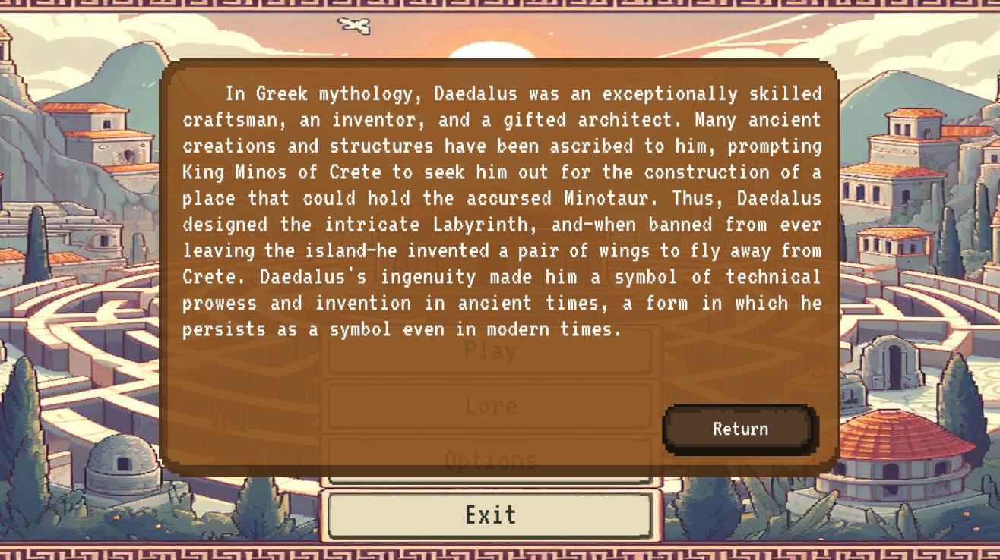
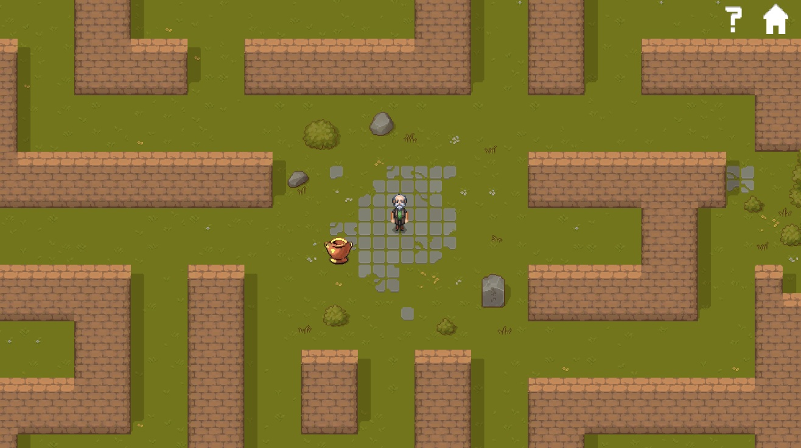
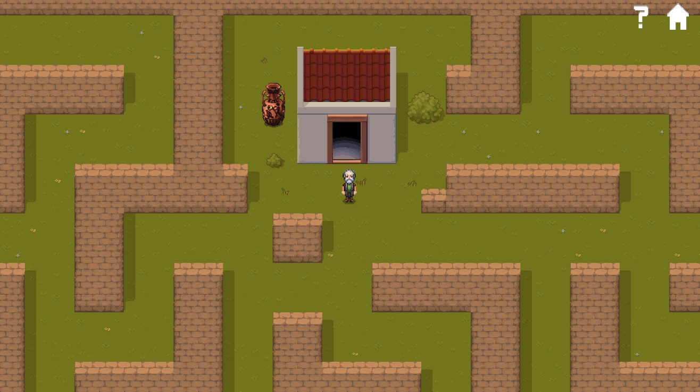
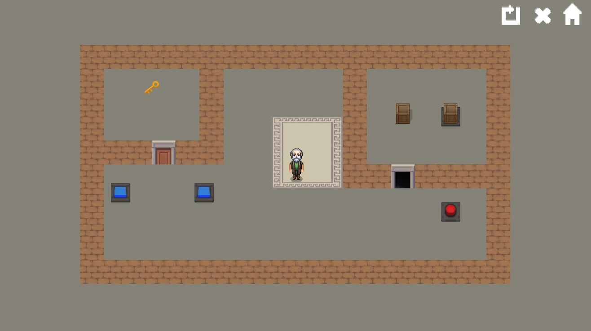
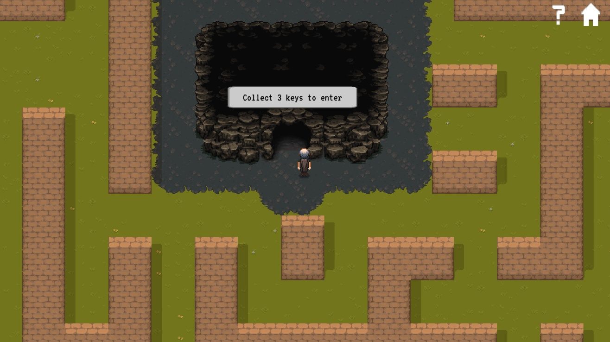
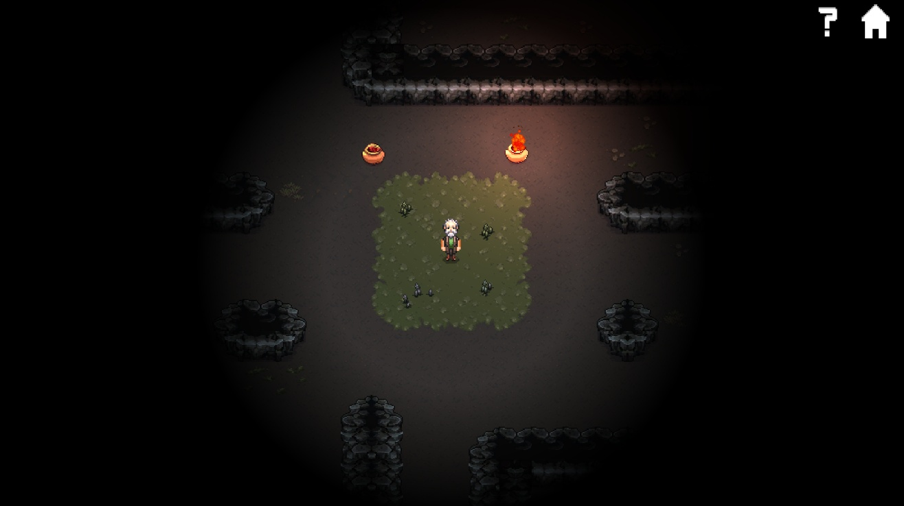
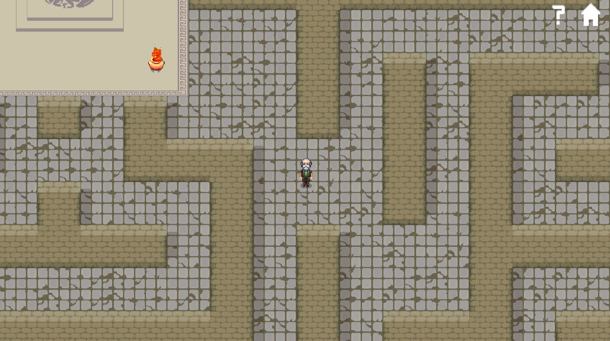
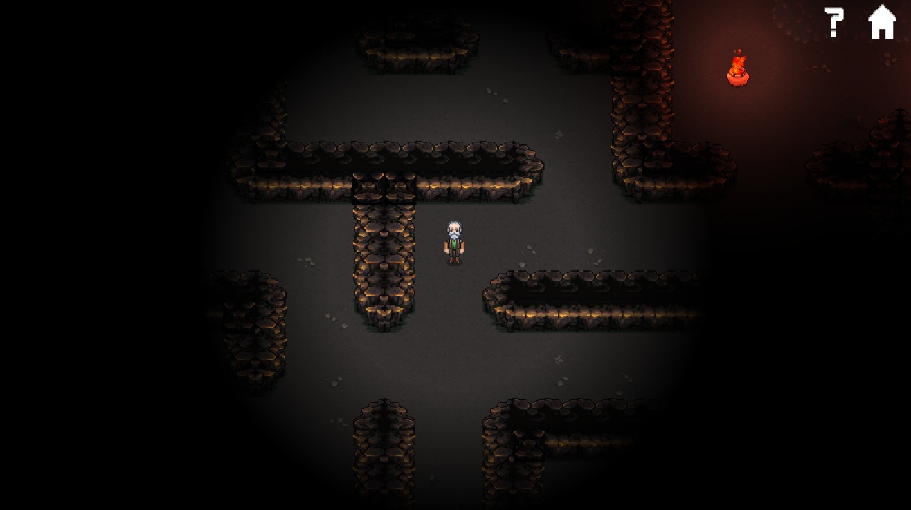

# 🏛️ Daedalus Escape
A 2D top-down puzzle game for PC where players navigate the mythological labyrinth of Daedalus. Solve puzzles, overcome darkness, and uncover the stories of Greek mythology while fighting to escape.

# Made By
Filip Tryhuk, Wojciech Zamarski, and Sebastian Zych.

As part of our Master of Science in Computer Science studies at Cracow University of Technology, specializing in Intelligent Systems & Augmented Reality, we worked together on several academic projects.
These projects were developed during courses such as Game Programming, Virtual and Augmented Reality Design, and Augmented Reality in Engineering Applications.

## Overview
**Daedalus Escape** is a **PC puzzle game developed in Unity**.  
Players take on the role of Daedalus, trapped inside his own labyrinth by King Minos. To escape, they must navigate a series of increasingly complex levels that challenge both logic and creativity. The game blends problem-solving mechanics with educational storytelling, introducing players to key figures and tales from Greek mythology.

## Key Features
- **Multiple levels**:
  - **Overworld 1** – introductory level to learn basic movement and mechanics.
  - **Cave 1** – introduces darkness, limiting player visibility.
  - **Overworld 2** – puzzles become more challenging, set in open areas.
  - **Cave 2** – final level with complex puzzles and limited visibility.
- **Player mechanics**: move up, down, left, right; interact with objects like stones and buttons.
- **Environmental challenges**: darkness and increasingly complex puzzles.
- **Lore and educational content**: collect hidden messages to learn about Greek mythology.
- **Graphics and sound**:
  - Stylized 2D labyrinth environments.
  - Character sprites representing Daedalus and other objects.
  - Music that reflects the theme of each level.

## Technologies Used
- **Unity Engine (C#)** – core development and scripting.
- **Custom 2D assets** for labyrinths and characters.
- **Level generation and puzzle scripts**
- **UI and animation scripting** – for overlays, tutorials, and player movement.

## Skills Demonstrated
- **2D game development** and top-down camera mechanics.
- **Puzzle and level design** with increasing difficulty.
- Integration of **educational content** with gameplay.
- **Player interaction mechanics**: object manipulation, buttons, and environmental challenges.
- **Audio integration** for mood and immersive gameplay.
- **End-to-end game workflow**: prototyping, asset implementation, and scripting.

## Screenshots
<table>
  <tr>
    <td></td>
    <td></td>
  </tr>
  <tr>
    <td></td>
    <td></td>
  </tr>
  <tr>
    <td></td>
    <td></td>
  </tr>
  <tr>
    <td></td>
    <td></td>
  </tr>
  <tr>
    <td></td>
    <td></td>
  </tr>
</table>

